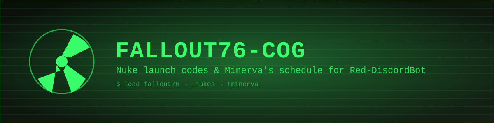

# fallout76-cog



A small [Red-DiscordBot](https://github.com/Cog-Creators/Red-DiscordBot) cog for Fallout 76 players: current nuke launch codes and a manually-maintained schedule for Minerva's rotating vendor location.

## Features

- **`!nukes`** — posts today's Alpha / Bravo / Charlie nuke launch codes, pulled live from [NukaCrypt](https://nukacrypt.com)
- **`!minerva`** — shows Minerva's current and next few scheduled locations
- **`!minervaset`** — admin commands to keep the Minerva schedule up to date, since her rotation skips weeks unpredictably and can't be calculated automatically

## Installation

This cog is installed the normal Red way, via the core Downloader cog:

```
[p]repo add fallout76-cog https://github.com/knkwebservices/fallout76-cog
[p]cog install fallout76-cog fallout76
[p]load fallout76
```

(Replace `[p]` with your bot's command prefix.)

## Commands

| Command | Description |
|---|---|
| `!nukes` | Show today's nuke launch codes |
| `!minerva` | Show Minerva's current and upcoming vendor location |
| `!minervaset add <YYYY-MM-DD> <location>` | *(Admin)* Add or update a schedule entry |
| `!minervaset remove <YYYY-MM-DD>` | *(Admin)* Remove a schedule entry |
| `!minervaset list` | *(Admin)* List every stored schedule entry |

## Credits

- Nuke launch codes courtesy of [NukaCrypt](https://nukacrypt.com) ([api.nukacrypt.com](https://api.nukacrypt.com))
- Built by [K & K Web Services](https://knkws.com)

## License

MIT
